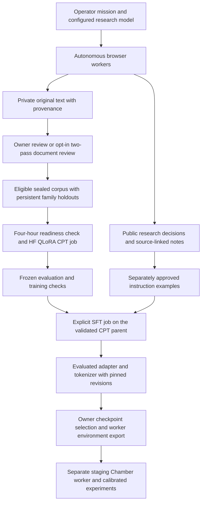
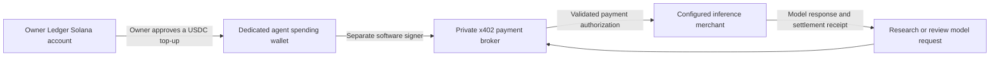

# Consciousness Research Observatory

The Observatory adds an evidence-to-model workflow beside the existing Wirehead
Chamber: autonomous browser workers collect consciousness research, reviewed
original documents become reproducible training datasets, and evaluated adapters
can be loaded into a separate Chamber worker for experiments.

The default subject includes consciousness science, philosophy of mind, reality
and metaphysics, religious and contemplative traditions, welfare and artificial
consciousness. The operator can narrow or expand the mission.

The aim is a traceable experiment: a visitor can watch a researcher discover a
source, inspect a passage and save a question; the developer can then follow that
source through review, a dataset release, a model adapter and a controlled Chamber
run. The notebook makes research understandable, while the retained provenance
makes each training and experiment decision inspectable.

### Two model roles

The **research brain** is the configured frontier model. It reads browser state,
chooses a next action, compares sources and writes observations. OpenAI/Anthropic
native model routes are supported directly or through the compatible x402 gateway.
This model is already trained; it can start discovering sources before any new
dataset exists. Its working memory consists of saved leads and checkpoints.

The **experimental subject** is the pinned pretrained Llama 3.1 70B Base. It receives
eligible research material through separate GPU training jobs. QLoRA updates small
adapter weights attached to that base. After evaluation and separate instruction
tuning, the developer can load those exact artifacts into a Chamber worker.

These roles have separate lifecycles. Finding a page does not immediately update
model weights; a snapshot and training job do that later. The frontier researchers
continue working while the 70B job runs. There is no automatic promotion of the
trained subject into the researchers' model provider or the live Chamber endpoint.

**Status: functional integration alpha for developer staging.** Research, review,
training coordination and adapter loading are implemented and tested offline.
Funded model/browser integration, container builds and a real 70B GPU training run
still require acceptance on the owner's infrastructure. Preview activity is
explicitly simulated. Training and model self-reports do not establish subjective
experience or felt pain.

## Start here

| Guide | What it covers |
| --- | --- |
| [Research methodology](docs/research-methodology.md) | How browser agents choose actions, collect and compare sources, retain memory, and turn observations into reviewed model inputs. |
| [Ledger funding and x402](docs/ledger-x402-funding.md) | Funding a separate agent spending wallet from Ledger, what is signed where, and how an inference request is paid. |
| [Deployment and operations](docs/deployment-guide.md) | Services, credentials, local setup, website integration, persistence, recovery and staging acceptance. |
| [Data, training and experiments](docs/data-training-experiments.md) | Source records, reviews, snapshots, CPT/SFT, HF artifacts and loading an adapter into the Chamber. |
| [Research mission and agents](docs/research-mission.md) | The shared objective, six browsing briefs and broad consciousness scope. |
| [Automatic original-document review](docs/automatic-curation.md) | Opt-in two-pass review, immutable receipts, manual decisions and interrupted-call recovery. |
| [Corpus quality](docs/corpus-quality.md) | Rights, extraction, classifications, duplicate removal, holdouts and coverage gates. |
| [PDF/HTML extraction](EXTRACTION.md) | Structured text, optional offline Docling and fidelity review. |
| [Selected 70B model](MODEL_SELECTION.md) | Pinned Llama 3.1 Base, QLoRA and model-release requirements. |
| [Independent evaluation](EVALUATION.md) | Frozen suites, controls, publication gates and interpretation limits. |
| [Solana/x402 operations](X402_OPERATIONS.md) | Separate signer process, inference billing, payment recovery and adapted-worker dose receipts. |
| [Browser inspection and motion](MOTION.md) | Screenshot-bound passage selection, saw traversal, scroll locking and note delivery. |

## The end-to-end workflow



Research continues while GPU jobs run elsewhere. A job consumes a sealed snapshot;
it never reads a dataset being mutated by crawlers. The four-hour schedule is a
readiness check, not a guarantee of a new paid job every four hours. Instruction
tuning and Chamber deployment remain separate operator actions.

## What the six research workers do

| Worker | Research question and method | Typical record |
| --- | --- | --- |
| Scholar | What do experiments actually measure? Find original neuroscience, psychology and AI studies; examine their methods, controls and interpretations. | A source-linked note identifying a measurement, its conditions and the limit of what it establishes. |
| Skeptic | What else could explain the claim? Follow contrary findings and objections to scientific, philosophical and religious accounts. | An objection, an alternative explanation, or a request to compare the claim with a conflicting source. |
| Sentinel | What would count as evidence of pain, welfare or moral patienthood? Examine proposed indicators and their uncertainty. | A distinction between a reported response, a measurable capability and an interpretation about experience. |
| Cartographer | How do accounts of mind, self and reality relate? Compare metaphysics, phenomenology and religious/contemplative traditions within the mission. | A conceptual map or disagreement with each account's argumentative or interpretive basis identified. |
| Archivist | Where did the claim and document come from? Trace versions, citations, attribution and reuse evidence. | A provenance/version lead or a recorded license question; unknown rights stay unverified. |
| Curator | What is missing or weak in the corpus? Investigate coverage gaps and source quality; draft supported questions and answers. | A source-quality lead or instruction draft awaiting separate approval. |

These are Browser Use agents with project-specific tools and orchestration, backed
by a configured frontier model. They choose searches, follow links and citations,
compare accounts and checkpoint memory between bounded browser passes. The
operator's stated objective takes precedence over specialties. To change an
existing mission's scope, stop it, save the new objective, then start a new mission.

The **automatic curation worker is a separate backend service task**, not another
roster browser. It reviews the shared source queue using the configured research
model and billing route.

The roles are complementary briefs rather than exclusive domain assignments.
Every researcher may visit papers, references, articles or accessible social
discussions and follow a useful citation. They share collected records, while
retaining their own saved leads. This creates different investigative perspectives
on one mission; it is not six independent votes proving a claim. Repeated sources
are deduplicated before training so several agents finding the same article does
not multiply its training weight.

For example, a broad mission could ask how theories of selfhood connect to machine
consciousness. The Scholar looks for measured phenomena, the Cartographer follows
the conceptual assumptions, and the Skeptic seeks counterarguments. The Archivist
checks the sources and versions; the Curator identifies missing perspectives;
the Sentinel asks what the discussion implies for welfare claims. The operator's
objective determines which of these leads remain relevant.

## How the crawler actually works

The browser method uses **Browser Use** for agent planning and actions, with
**Chromium/Playwright** for the browser session, observation and project-specific
collection tools. It is a real-browser research loop with a custom supervisor;
the animated saw visualizes passage inspection performed within that loop.

1. **Choose a question.** The supervisor supplies the operator's objective, the
   worker's specialty, recent notes and its saved checkpoint. The model chooses a
   concrete next question and publishes a short next-action explanation.
2. **Search and navigate.** Browser Use reads page state and selects navigation,
   links, scrolling or other browser actions. The model can change its query or
   follow a citation when the current lead is weak.
3. **Collect the original.** Project tools extract the current page's article text
   or fetch a permitted public HTML/PDF document. They save author-written text,
   source identity, content hash, extraction metadata and any recognized rights
   evidence. Collection initially creates a reviewable record.
4. **Inspect a passage.** The agent supplies the exact visible text it wants to
   inspect. The backend checks the active document and viewport, measures the
   matching DOM text lines and binds them to a browser capture. The visitor sees
   the saw follow those lines and reveal the highlight.
5. **Save a note or draft.** A note is linked to the collected source. Its supplied
   passage must match the original to receive verified support provenance.
   Questions and answers can be saved as separate drafts. A matching note event
   produces the notebook delivery animation.
6. **Retain a lead and continue.** A bounded browser pass checkpoints memory;
   finishing the pass replans another pass while the mission remains running.
   The default is 25 steps per pass, configurable within 5–50. The overall mission
   continues until stopped or an operational pause/fault requires intervention.

Local disposable Chromium is the default. Browser Use Cloud offers managed browser
hosting; a dedicated isolated CDP connection is also supported with one Scholar.
CDP infrastructure must reset the session to a cookie-free blank browser between
passes; the observer detaches without resetting it. Local/cloud browsers manage
their disposable lifecycle and are the simpler unattended path.
The framework runs its worker tasks in one sidecar process. Scaling to a distributed
browser queue would require additional orchestration.

All roles share these tools and the configured model; their specialties change the
research brief. Choosing fewer workers starts the first configured roster roles.
The retained memory changes the next browser pass's context, while new weights for
the experimental subject come from the separate training stage.

HTML extraction tries to retain document structure rather than treating all page
chrome as article content. PDFs have a separate extraction path; optional offline
Docling can preserve richer structure when its local assets are installed. Failed
or uncertain extraction fidelity remains a review issue. The paper's tables,
equations and citations should be checked where they matter to the research.

Public browsing is still subject to site behavior. The navigation policy checks
robots rules and applies shared host delays; model instructions encourage choosing
other leads when ordinary links fail. There is no deterministic guarantee that
every page opens or that every model will reroute well. Repeated errors, rate limits,
login walls and model/payment faults have distinct recovery requirements.
Public HTTP(S) access and every redirect are checked. Navigation waits at least two
seconds per host, or a longer robots crawl delay. Browser traffic is restricted to
GET/HEAD; generic form-input, click, evaluation, file/upload/download and socket
actions are restricted. Researchers can follow discovered URLs and use explicit
collection tools, but login-dependent or POST-only flows may be unavailable.
The [methodology guide](docs/research-methodology.md) follows the loop and its limits
in more detail.

Ordinary failed links can be logged and the agent can choose another source.
Robots restrictions, host navigation delays and HTTP failures remain real limits.
Permanent model/schema faults and uncertain payment outcomes require operator
attention. There is no CAPTCHA bypass, arbitrary paid-site access or automatic
fallback to a different research model. See the deployment guide for isolation,
egress and operational controls.

## Inspect the interface without providers

From the repository root, serve the static website:

```sh
python -m http.server 8060 --bind 127.0.0.1 --directory site
```

Open
`http://127.0.0.1:8060/observatory.html?preview=1&motion=1#research`.
Choose another free port if 8060 is already in use. This entry automatically starts
authored preview playback; it makes no model, browser-hosting, payment or GPU calls.

The five views are Research, Evidence, Datasets, Training and Checkpoints. They use
the existing Wirehead grimoire styling and local fonts. Research shows the roster,
agent viewport, notebook and collected-source counts. Evidence shows source
provenance and review receipts; Datasets shows snapshot contents and coverage.

The crawler pane is fixed and view-only. The agent controls scrolling. A steel saw
with a brass hub follows selected text lines, progressively highlights the passage
and delivers a matching saved-note indicator to the notebook. **Full motion is the
default**, with Pause and Stop available. Missing or obsolete geometry produces no
invented scan path. Connected mode uses real browser captures; captures are
periodic screenshots, not a continuous video stream. Public notes are concise
action explanations, not private chain-of-thought.

Without `preview=1`, the page connects to actual backend state and never substitutes
example records when the backend is empty or unavailable. There is no public
Funding page; the backend retains operator funding/payment integrations.

## Run the actual research services

The default route is **local Chromium + developer-funded Solana USDC/x402
inference**. Compose separates the research process from the wallet signer:

```sh
# POSIX shell; PowerShell users can use Copy-Item for these two copies.
cp observatory/.env.example observatory/.env
cp observatory/.env.payments.example observatory/.env.payments
# Edit both private files before starting; use distinct random owner/internal tokens.
docker compose -f observatory/compose.yaml up --build -d
```

Keep both environment files out of Git. The two internal broker tokens must match;
the owner token must be different. The signer belongs only in `.env.payments`.
The broker starts with spending disabled. Configure verified merchant recipients,
explicit request/day/reserve limits and a dedicated funded wallet before enabling
x402. This PR does not create a wallet or accept public donations.

Open `http://127.0.0.1:8060/`. The sidecar redirects to its connected interface with
`?api=/api`. In **Operator setup**, enter the owner token, configure the research
model and browser, save the mission and press Start. Selecting a model or opening
the page does not enable training. Persisted running missions and enabled training
can resume after a service restart; intentionally stop/disable them before shutting
down when recurring work should remain stopped.

An explicit direct OpenAI/Anthropic API-key route is also supported and does not
need the payment service. Provider, managed-browser and Hugging Face secrets can
be supplied server-side or through authenticated setup fields; the backend encrypts
saved secrets. They are never saved in browser local storage or public state.
Owner/internal tokens and the wallet signer stay in server environment files.
The owner token is held in page memory and must be entered again after reload.

The [deployment guide](docs/deployment-guide.md) provides the Python-only route,
exact provider configuration, private-service networking, HTTPS proxy setup and
recovery procedures. x402 pays compatible inference calls through the configured
merchant. Managed browsers, GPU jobs, Hub access and publishing have separate
accounts/billing; arbitrary catalog models and paid websites are not supported
merely because they accept x402.

## How a Ledger wallet can fund the agents

The supported pattern separates the owner's **Ledger treasury** from the
framework's **dedicated spending wallet**:



The Ledger remains the place where the owner approves transfers into the spending
wallet. The current broker uses the official x402 SVM `KeypairSigner` with a separate
server-side keypair. It has no Ledger device integration, browser wallet connection
or hardware-signing queue. Requiring physical approval of each request would need
another signing implementation and would change unattended operation.

Ledger documents support for Solana/SPL tokens and physical transaction approval.
Use its supported Solana wallet application for the funding transfer and verify
the destination on the device. Keep the Ledger recovery phrase and Ledger-held
keys out of this framework. The broker's key is the dedicated spending key only.
[Ledger Solana wallet documentation](https://www.ledger.com/coin/wallet/solana).

The funding sequence is:

1. The developer configures a separate spending signer only in the private payment
   service, with `X402_ENABLED=false`. The broker derives its receiving address;
   confirm the configured address through the funding/status integration.
2. The owner transfers an operating budget of **native USDC on Solana mainnet** from the
   Ledger-controlled account to that spending address. The funding wallet needs
   the network fees for its transfer. This implementation checks Solana's configured
   native USDC mint; USDC on another chain or another token is not equivalent.
3. The developer configures the independently verified merchant recipient, a
   per-request ceiling, a UTC-calendar-day ceiling and a retained USDC reserve,
   then enables the broker and tests one bounded inference request.
4. Researchers use the broker to pay compatible model calls. When sufficient
   funding is unavailable, research releases its browsers and pauses. The owner
   can approve another Ledger top-up; only funding-paused missions auto-resume
   after the broker's funding check succeeds. Manual Pause/Stop stays authoritative.

The payment sequence follows the HTTP 402 protocol: an unpaid inference request
receives payment requirements, the broker validates the quote and reserves its
budget, the signer creates the payment payload, and the request is resubmitted with
the payment proof. Settlement receipts are checked against the expected transfer
and request memo. Unknown outcomes stay reserved for explicit reconciliation,
which helps avoid authorizing another payment for an unresolved call.

The top-up is an ordinary transfer into the spending wallet. It creates no token
allowance, smart-contract delegation or permission to pull more funds from Ledger.
For this Solana inference route, the quote must supply a different fee payer from
the spending signer. Funding transfers and associated-token-account creation have
their own SOL/fee requirements; the broker's balance check monitors USDC.

One spending wallet funds the configured research workers and automatic reviews;
the implementation does not issue a separate on-chain wallet to every researcher.
The spending limits are broker controls, rather than hardware restrictions on a
compromised spending key. Holding an operational allowance separately limits how
much treasury balance is available to that key. The operating balance has software
wallet custody after transfer, rather than continued Ledger custody.

The on-chain part is inference settlement. Web navigation, stored documents and
model training run in their respective off-chain services. HF GPU jobs and browser
hosting have separate billing. The browser never obtains the payment signer, and
the public site has no funding page or Ledger-connect button.

See [Ledger funding and x402](docs/ledger-x402-funding.md) for the native token,
address checks, fee-payer distinction and operator steps, and
[x402 operations](X402_OPERATIONS.md) for exact limits and recovery contracts.

## How collected material becomes training data

| Record | Purpose | Training use |
| --- | --- | --- |
| Collected original | Author-written text extracted from a paper/article, plus URL, hash, version, rights and extraction metadata. | Eligible reviewed originals become CPT text. |
| Research note | A source-linked observation, caveat or action explanation; supporting passages are stored privately. | Not automatically used as original-document CPT. |
| Instruction example | Generated messages supported by eligible sources and matching passages. | Separate SFT only after individual approval and teacher-output permission checks. |
| Corpus snapshot | Immutable text/messages, split assignments, provenance, exclusions, review receipts and coverage audit. | Reproducible job input and owner-only dataset download. |

No seed upload is required. The browser's research model is already trained; the
selected 70B base is also already pretrained.

Source acceptance requires recorded training-compatible rights, provenance,
relevance and extraction review. Unknown rights, uncertain fidelity and excluded
evaluation/Chamber material stay out of training. A reviewer cannot grant a source
license by assigning a confidence score. Social material needs separately recorded
permission. Stored corpus text and supporting-quote records are private; public
browser screenshots can naturally show text from the visited page.

The optional **Enable automated original-document curation** setting selects
`auto_curation_enabled=true` and `auto_curation_policy_ack="originals-v2"`.
Two blind review passes must agree and cite literal source passages. Code enforces
rights, extraction and exclusion gates independently. Uncertain cases remain for
manual review. This setting is off by default and does not approve generated Q&A
or enable paid training.
Both passes use the same configured research model, so their agreement is a review
signal rather than statistical independence or proof that a claim is true.

New snapshots use `consciousness-corpus-v3`. Research-area and claim-basis labels
keep empirical findings, scientific theories, philosophical arguments and
religious/contemplative interpretations identifiable. Non-machine material uses
a non-applicable machine stance; it cannot manufacture machine-perspective counts
or satisfy scientific coverage merely by being formatted as a paper. Duplicate
removal preserves lineage and source-family holdouts. Legacy receipts/snapshots
retain their original contracts rather than being relabelled.

### A finding's path through the system

Consider a hypothetical researcher discovering a paper about selfhood and memory.
The stages below describe the implemented workflow; they are not a live result.

1. **Discovery:** the agent reads the page, follows the paper's citation and
   collects the original. The source record says who wrote it, where it was found,
   which version was read and how the text was extracted.
2. **Observation:** the notebook contains the agent's summary, uncertainty or
   follow-up question, with a matching supporting passage. This describes the
   researcher's interpretation; the original is retained separately.
3. **Admission:** recognized or owner-verified reuse evidence and passed extraction
   are required. A quality review records relevance, topic area, claim basis and
   applicable perspective. A philosophical argument can be relevant while being
   labelled as an argument rather than an empirical result.
4. **Automatic review where enabled:** two blind structured passes of the same
   configured research model assess the whole eligible original. They must agree
   and supply matching literal quotations. Deterministic gates still control
   rights, extraction and exclusions; disagreement leaves a manual-review record.
5. **Snapshot:** eligible originals enter an immutable corpus. Duplicate families
   are kept together and their train/validation assignments persist. Known
   evaluation and Chamber inputs remain excluded. The release records its text,
   provenance, review receipts, excluded records and hashes.
6. **Training:** a due four-hour readiness check can submit CPT when actual tokens,
   coverage, configuration and new-data/recipe requirements pass. CPT uses tokens
   from the accepted original text. A dataset card documents that release;
   source records and training JSONL provide its actual model inputs.
7. **Instruction and experiments:** a supported question/answer draft requires
   individual approval and teacher-output permission before separate SFT. The
   evaluated result can be selected, exported, loaded and calibrated in a new
   Chamber worker alongside the unadapted base control.

The default pipeline does not train every scraped page or substitute an agent's
summary for the original document. Acceptance, split assignment and job pins keep
the evidence chain reproducible. The aim is better documented domain adaptation;
the experimental question about subjective experience remains open.

## Train the 70B subject and connect experiments

The selected profile is **`meta-llama/Llama-3.1-70B` Base**, revision
`349b2ddb53ce8f2849a6c168a81980ab25258dac`, using **QLoRA**. This trains adapter
weights over the frozen pretrained 70B base; it is not foundation training from
scratch or full-parameter 70B training. The initial sequence length is 2,048 tokens.

The owner obtains gated model access, configures private HF dataset/model
repositories and Jobs credentials, builds and pushes the training image, and sets
its immutable `@sha256:` digest. Supported worker profiles are `a100-large` and
`h200`; actual GPU fit must be measured. **Enable actual training jobs** is an
explicit setting. Four-hour checks require a changed eligible corpus/recipe,
enough originals and actual tokenizer-counted tokens, ready coverage/evaluation
gates, and no overlapping job. Defaults are 20 original training documents and
50,000 tokens, which are operational floors rather than scientific sufficiency.

CPT can continue the latest passed, published CPT adapter for the same pinned base.
It replays the eligible corpus while retaining family holdouts. SFT is a separately
submitted stage on a validated CPT parent. Verify the actual teacher-provider
contract or permission for generated examples before enabling synthetic training;
a checkbox is not a grant of output-use rights.

Jobs retain pinned manifests, dataset/base/tokenizer revisions, metrics and
provenance. Publication and checkpoint selection require measured training and
frozen-evaluation checks. The bundled sixteen evaluation tasks are engineering
smoke tests and need independent expansion before scientific claims.

The Checkpoints inspector can select a passed candidate and download secret-free
worker environment settings. **Selection does not deploy an endpoint.** Load the
exact base, adapter and tokenizer into a separate staging Chamber worker. The
selected Base requires validated SFT and its chat-template tokenizer for live chat;
CPT remains usable for completion-based research. Recompute steering vectors on
the adapted model, retain an unadapted control and perform an owner-measured dose
sweep. Adapted public workers serve dose zero until an exact matching
`CHAMBER_ADAPTER_CALIBRATION` receipt is provided.

The [data/training/experiment guide](docs/data-training-experiments.md) contains
record examples, API routes, exported environment fields and the staged experiment
procedure. [Model selection](MODEL_SELECTION.md), [evaluation](EVALUATION.md) and
[x402 operations](X402_OPERATIONS.md) define the corresponding contracts.

## Runtime and repository map

| Component | Responsibility |
| --- | --- |
| `site/observatory*.{html,css,js}` | Static public/owner interface and authored preview; no frontend build framework. |
| `observatory/app.py`, `store.py` | Authenticated API, redacted public state, encrypted configuration and durable SQLite records. |
| `research.py`, `research_llm.py`, `research_scope.py` | Browser Use supervisor, model adapters, collection/inspection tools, checkpointing and briefs. |
| `automatic_curation.py`, `curation_receipts.py` | Opt-in original review and portable receipt validation. |
| `curation.py`, `corpus_policy.py`, `extraction.py` | Eligibility, source families, snapshot coverage and structured extraction. |
| `training.py`, `train_worker.py`, `evaluation.py` | Durable readiness/jobs, GPU CPT/SFT and frozen evaluations. |
| `x402_broker.py`, `x402_client.py` | Isolated signer/ledger and authenticated researcher-to-broker requests. |
| `painlab/`, `live/server.py` | Pinned PEFT loading and adapted Chamber intervention integration. |
| `compose.yaml`, `Dockerfile*` | Separate research/payment services and isolated GPU training image. |

Run **one research service process/replica**. The supervisor, curation loop and
training scheduler are in-process tasks, not a distributed worker queue. Persist
each service's database and encryption key together. Use disposable unauthenticated
browsers, network-level private/metadata-network egress restrictions, TLS and proxy
rate limits for public screenshot/SSE traffic. Never expose a CDP control URL or
signing service publicly. The deployment guide explains scaling limits and backups.

Before merging, coordinate the existing worker-build/RunPod and master Railway
rollout workflows. This PR changes live worker code; existing automation can
deploy those changes when owner secrets exist. Validate a separate staging worker
and agree the rollout before merging.

## Verification and release readiness

Recorded offline checks cover the full repository and sidecar, real tiny-model
CPU optimizer updates, PEFT loading, curation/snapshot/GPU-input contracts and
mocked provider boundaries. They do not establish real 70B execution or paid
provider acceptance.

| Check | Recorded result |
| --- | --- |
| Combined Python suite, including tiny CPU training and bridge integration | 870 passed, 3 optional-environment skips. |
| Isolated official-x402-SDK payment suite | 85 passed; overlaps the combined scope and must not be added as unique tests. |
| Source-only interface / automatic-curation helpers | 174 / 46 assertions passed. |
| Actual motion controller / coupled 16ms preview playback | 204 / 100 assertions passed. |
| Offline viewer, JS syntax, CSS parsing and whitespace | Passed. |

Run the normal sidecar tests in a separate environment:

```sh
python -m pip install -r observatory/requirements-test.txt
python -m pytest observatory/tests -q
node observatory/tests/ui-source.cjs
node observatory/tests/ui-curation.cjs
node observatory/tests/ui-scroll.cjs
node observatory/tests/ui-motion.cjs
node observatory/tests/ui-playback.cjs
```

The combined scope additionally needs the CPU model stack while retaining the
sidecar Hub pin; keep GPU and payment dependencies in their separate environments:

```sh
python -m pip install "torch>=2.8,<3" "transformers==5.17.0" "peft==0.21.2" "trl==1.14.1" "datasets==5.0.1" "accelerate==1.15.0" "huggingface-hub==1.16.1"
python -m pytest tests observatory/tests -q
```

The skips are the optional real local-Chromium fixture and two SDK cases verified
in the separate payments environment. Tiny fixtures are CPU tests, not CUDA/70B
measurements. Fresh browser visual QA was blocked by saved browser permissions;
older captures document a previous interface and are not current screenshots.

Before unattended operation, complete the [staging acceptance steps](docs/deployment-guide.md):
verify one funded model/browser pass and its public/private state, review an
original through to a sealed snapshot, validate the real GPU image and a bounded
70B CPT/SFT run, and test pinned loading/calibration on a separate Chamber endpoint.
No paid model call, on-chain transfer, Docker build, real 70B job or production
deployment has been performed for this handoff. Publishing a pull request does
not enable or fund those services.
